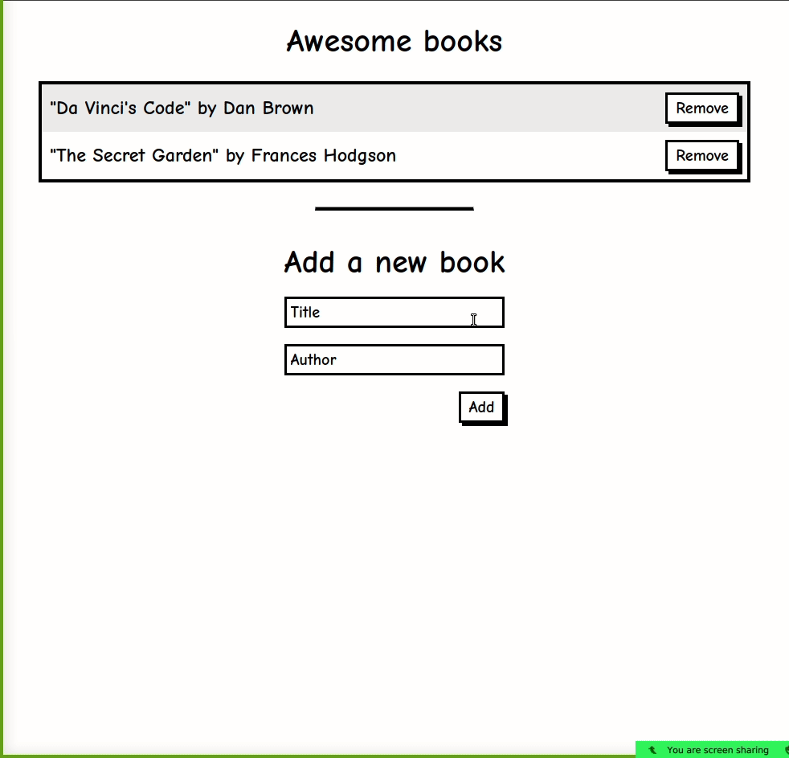

# Awesome books

> A library that stores books in your browser's Local Storage.



## Built With

- HTML
- CSS
- SASS
- JavaScript
## Live Demo

[Live Demo](https://melaniesigrid.github.io/awesomeBooks/)

## Getting Started

To get a local copy up and running follow these simple example steps.

- Clone this repository with git clone```git@github.com:melaniesigrid/awesomeBooks.git``` using your terminal or command line.
- Change to the project directory by entering : <br>
```cd awesomeBooks``` in the terminal

## Authors

👤 **Melanie Sigrid**

- GitHub: [@melaniesigrid](https://github.com/melaniesigrid)
- Twitter: [@SiriMoon11](https://twitter.com/SiriMoon11)
- LinkedIn: [LinkedIn](https://www.linkedin.com/in/melanie-arellano-92aaa9194/)

👤 **Andrés Felipe Arroyave Naranjo**

- GitHub: [@JohnFTitor](https://github.com/JohnFTitor)
- Twitter: [@johnftitor](https://twitter.com/johnftitor)
- LinkedIn: [Andres](https://www.linkedin.com/in/andresfelipe117/?locale=en_US)

## 🤝 Contributing

Contributions, issues, and feature requests are welcome!

Feel free to check the [issues page](../../issues/).

## Show your support

Give a ⭐️ if you like this project!

## Acknowledgments

- Hat tip to our code reviewers at Microverse

## 📝 License

This project is [MIT](./MIT.md) licensed.